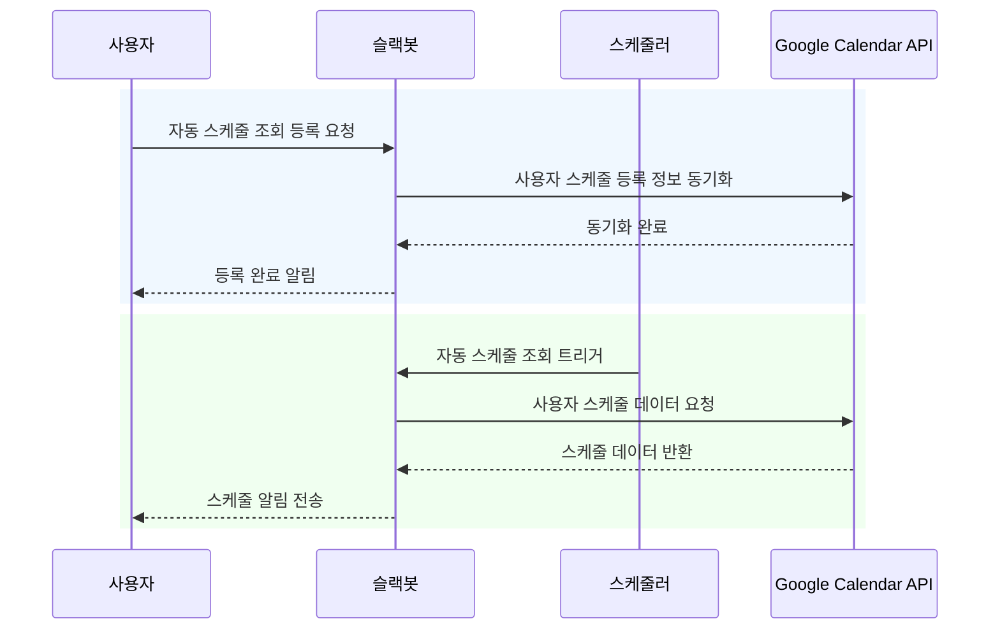

# notify-me
구글 캘린더 일정을 지정한 시간에 슬랙으로 자동으로 알림 받을 수 있도록 자동화하는 서비스

### 문제 상황

- 전사 스케줄이 1개의 캘린더를 통해 관리되는 환경
- 출근 시 본인이 오늘 어떤 미팅이 있는지 확인하려면
  여러 스케줄(휴가, 출장, 외부인 방문 등)이 혼합된 캘린더 속에서 본인의 미팅 스케줄을 찾아야함
- 또한 업무 협의를 위해 특정 팀원을 찾았으나 알고보니 해당 팀원이 휴가임을 뒤늦게 알게됨

위와 같은 문제를 자동화를 통해 해소하고자 함

### 기대 효과

- 하루 시작 전 일정 정리
  - 사용자가 설정한 시간에 자동으로 당일 일정을 받아볼 수 있어 하루를 계획하는데 도움을 줌
- 중요 일정 알림 놓치지 않기
  - 정해진 시간에 캘린더 내용을 확인할 필요가 없이 슬랙 메세지로 알림을 받을 수 있음

### 예상 시나리오

- 사용자가 원하는 시간에 스케줄이 자동 조회되도록 등록 요청
  - 자동 조회가 될 시간과 사내 캘린더에서 사용중인 이메일을 입력 
- 일정 간격으로 스케줄러가 돌면서 사용자가 등록한 시간에 스케줄을 자동으로 조회

### 시퀀스 다이어그램

